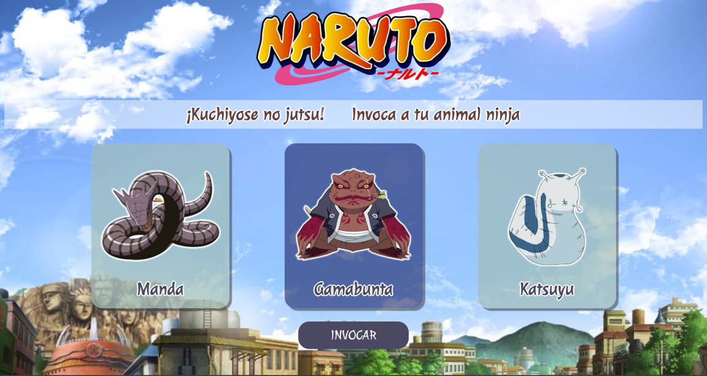
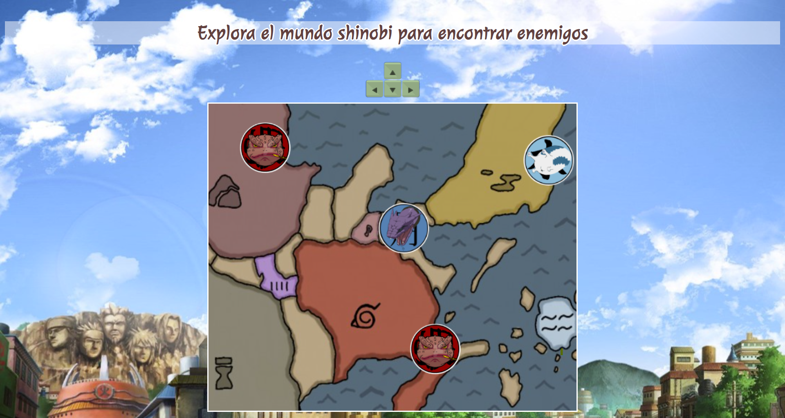
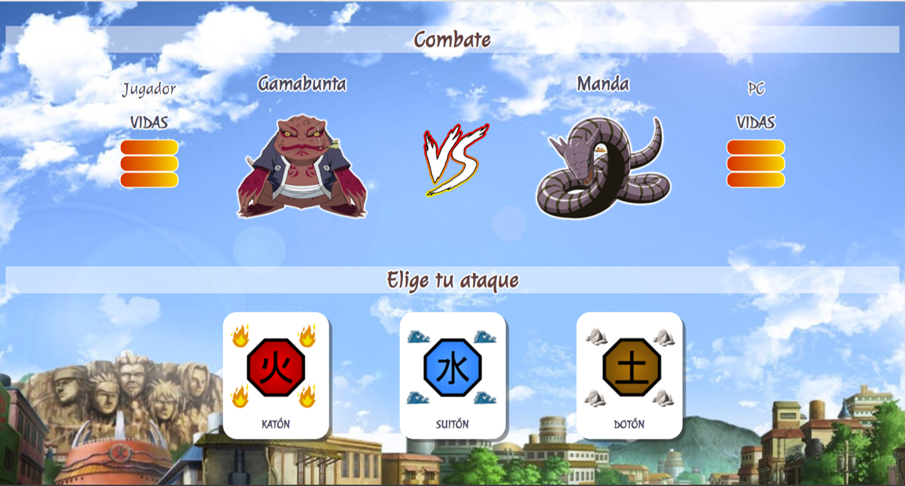
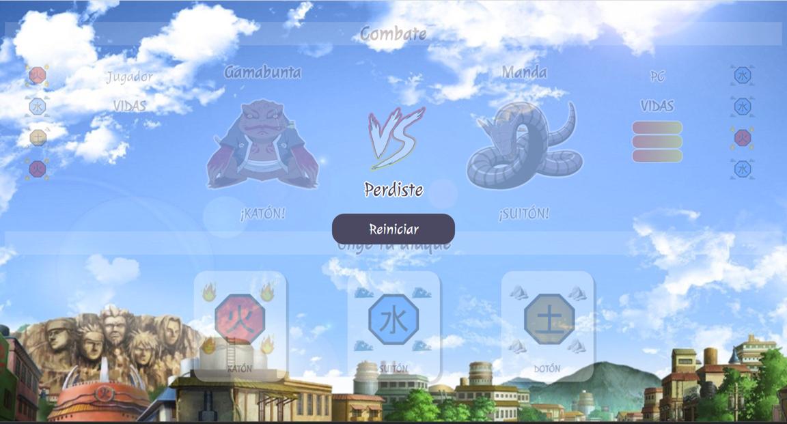

# Bienvenido Ninja! 

Para jugar el combate de bestias, elige a tu animal Ninja. 

Recorre el mapa con el teclado y encuentra a tu contrincante

Al encontrar un contrincante empezará la batalla!
Ataca al enemigo  eligiendo estilos de jutsu hasta terminar con sus vidas

Puedes elegir los estilos

- KATÓN (Fuego)
- SUITÓN (Agua)
- DOTÓN (Tierra)

Usa estratégicamente el agua para apagar el fuego, el fuego para destruir la tierra y la tierra para secar el agua en este emocionante juego de estrategia elemental

Cuando uno de los animales pierda todas sus vidas, el juego terminará!

### ¡Ikuzu!
